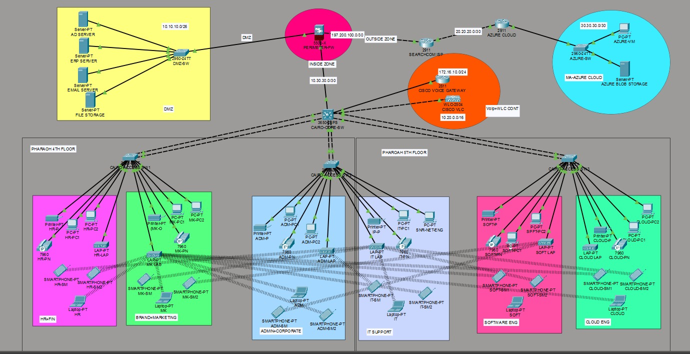

# Enterprise Network Design – Cairo Telco

## Overview
This project presents the design and implementation of an enterprise-level network infrastructure for a telecommunications company. The network supports multiple departments across two floors with secure, scalable, and high-performance architecture.

---

## Key Features
- VLAN segmentation for data, wireless, and VoIP traffic
- DMZ implementation for secure server access
- OSPF dynamic routing for efficient communication
- NAT and ACL-based security using Cisco ASA firewall
- Wireless network using WLC and Access Points
- Azure cloud connectivity

---

## Network Architecture

---

## Technologies Used
- Cisco Packet Tracer
- VLANs & Inter-VLAN Routing
- OSPF Routing Protocol
- Cisco ASA Firewall (NAT, ACL)
- Wireless LAN Controller (WLC)
- VoIP Configuration
- Azure Cloud Integration

---

## Files Included
- Packet Tracer File (.pkt)
- Project Report (.pdf)
- Network Diagram Image

---

## Results
- Successful inter-VLAN communication
- Secure internet access via NAT
- Controlled access to DMZ servers
- Seamless wireless connectivity across floors
- Cloud access to Azure resources

- ## Design Decisions

- VLAN segmentation was used to separate traffic types (data, wireless, VoIP) for better performance and security.
- A DMZ was implemented to isolate critical servers from the internal network while allowing controlled external access.
- OSPF was chosen for dynamic routing due to its scalability and fast convergence.
- NAT was configured on the firewall to enable secure internet access for internal users.
- Wireless LAN was centrally managed using WLC for seamless roaming across multiple floors.

---

## Author
Harsh Maurya
